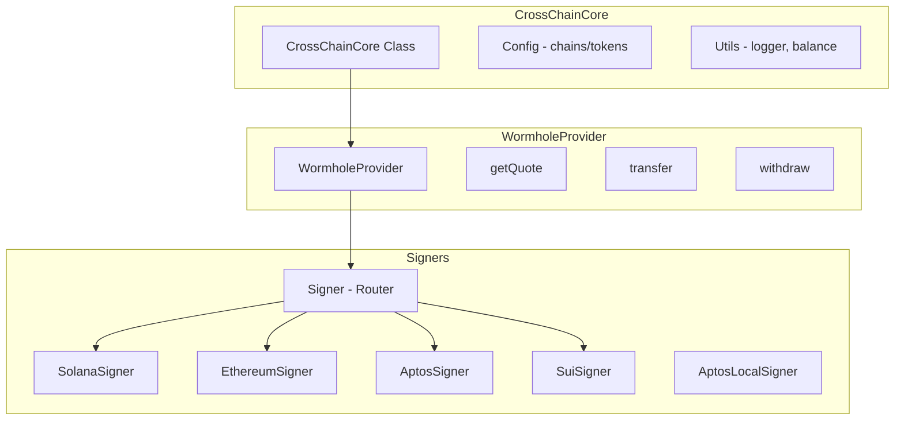

# Aptos Cross-Chain Core

A TypeScript SDK for cross-chain USDC transfers to and from the Aptos blockchain using [Circle's CCTP](https://www.circle.com/en/cross-chain-transfer-protocol) (Cross-Chain Transfer Protocol) via the [Wormhole](https://wormhole.com/) bridge.

## Overview

This package enables seamless USDC transfers between Aptos and other supported blockchains. It abstracts the complexity of cross-chain transactions, providing a simple API for:

- **Transfers**: Move USDC from external chains (Solana, Ethereum, etc.) to Aptos
- **Withdrawals**: Move USDC from Aptos to external chains
- **Balance Queries**: Check USDC balances across all supported chains
- **Quote Estimation**: Get transfer costs and fees before executing

## Architecture



## Supported Chains

| Network   | Mainnet Chain ID | Testnet Chain ID   | Context            |
| --------- | ---------------- | ------------------ | ------------------ |
| Aptos     | 1                | 2                  | Destination/Source |
| Solana    | mainnet-beta     | devnet             | Source/Destination |
| Ethereum  | 1                | 11155111 (Sepolia) | Source/Destination |
| Base      | 8453             | 84532 (Sepolia)    | Source/Destination |
| Arbitrum  | 42161            | 421614 (Sepolia)   | Source/Destination |
| Avalanche | 43114            | 43113 (Fuji)       | Source/Destination |
| Polygon   | 137              | 80002 (Amoy)       | Source/Destination |
| Sui       | mainnet          | testnet            | Source/Destination |

## Supported Tokens

Currently, only **USDC** is supported via Circle's Cross-Chain Transfer Protocol (CCTP).

## How It Works

1. **Initialize**: Create a `CrossChainCore` instance with your network configuration
2. **Get Provider**: Obtain a `WormholeProvider` for executing transfers
3. **Get Quote**: Calculate fees and transfer parameters
4. **Execute Transfer**: Sign and submit the cross-chain transaction
5. **Wait for Completion**: The SDK handles attestation and claiming on the destination chain

### Transfer Flow (External Chain → Aptos)

```
Source Chain Wallet → CCTP Burn → Wormhole Attestation → Aptos Claim → Aptos Wallet
```

### Withdrawal Flow (Aptos → External Chain)

```
Aptos Wallet → CCTP Burn → Wormhole Attestation → External Chain Claim → Destination Wallet
```

## Signers

A **Signer** is a component that handles transaction signing and submission for a specific blockchain. The SDK uses signers to interact with the Wormhole bridge protocol, implementing the `SignAndSendSigner` interface from the Wormhole SDK.

### Available Signers

| Signer             | Chain      | Description                                                             |
| ------------------ | ---------- | ----------------------------------------------------------------------- |
| `Signer`           | All        | Router signer that delegates to chain-specific signers based on context |
| `SolanaSigner`     | Solana     | Signs transactions via `SolanaDerivedWallet`                            |
| `EthereumSigner`   | EVM chains | Signs transactions via `EIP1193DerivedWallet`                           |
| `AptosSigner`      | Aptos      | Signs transactions via wallet adapter (user interaction)                |
| `AptosLocalSigner` | Aptos      | Signs transactions with a local `Account` (programmatic)                |
| `SuiSigner`        | Sui        | Signs transactions via `SuiDerivedWallet`                               |

### Why Two Aptos Signers?

Cross-chain transfers involve two distinct phases, each with different signing requirements:

#### The Two-Phase Transfer Process

1. **Initiate Phase** (Source Chain): User burns USDC on the source chain and creates an attestation
2. **Claim Phase** (Destination Chain): The attested USDC is minted on the destination chain

These phases require different types of signing:

| Phase               | Signer             | User Interaction | Use Case                                |
| ------------------- | ------------------ | ---------------- | --------------------------------------- |
| Initiate (Withdraw) | `AptosSigner`      | ✅ Required      | User burns USDC from their Aptos wallet |
| Claim (Transfer)    | `AptosLocalSigner` | ❌ Automatic     | System claims USDC on behalf of user    |

#### AptosSigner

Used for **withdrawals** where the user initiates a transaction from their Aptos wallet:

- Requires wallet adapter connection and user approval
- User must explicitly sign to burn their USDC
- Standard wallet interaction flow

#### AptosLocalSigner

Used for **transfers** where USDC arrives on Aptos from another chain:

- Signs programmatically with a local `Account` object
- No user interaction required
- Enables automatic claiming without user action

#### The Derived Wallet Advantage

When transferring from external chains (Solana, Ethereum, etc.) to Aptos, the SDK uses **derived wallets**. A derived wallet creates an Aptos account address mathematically linked to the user's external chain public key.

**This means users don't need an existing Aptos wallet to receive funds!**

The flow works like this:

1. User connects their Solana wallet (for example)
2. SDK derives a corresponding Aptos address from the Solana public key
3. User signs the burn transaction on Solana
4. USDC is automatically claimed on Aptos using `AptosLocalSigner`
5. Funds appear in the derived Aptos address, controlled by the same Solana key

This design enables seamless onboarding: users can transfer USDC to Aptos using only their existing external chain wallet.

## Installation

```bash
pnpm add @aptos-labs/cross-chain-core
```

or

```bash
npm install @aptos-labs/cross-chain-core
```

## Quick Start

```typescript
import { CrossChainCore, Network } from "@aptos-labs/cross-chain-core";

// Initialize the core with network configuration
const crossChainCore = new CrossChainCore({
  dappConfig: {
    aptosNetwork: Network.TESTNET,
    // Optional: Custom Solana RPC
    solanaConfig: {
      rpc: "https://api.devnet.solana.com",
    },
  },
});

// Get the Wormhole provider
const provider = crossChainCore.getProvider("Wormhole");
```

## API Reference

### CrossChainCore

The main entry point for cross-chain operations.

```typescript
const core = new CrossChainCore({
  dappConfig: {
    aptosNetwork: Network.TESTNET | Network.MAINNET,
    disableTelemetry?: boolean,
    solanaConfig?: {
      rpc?: string,
      priorityFeeConfig?: {
        percentile?: number,
        percentileMultiple?: number,
        min?: number,
        max?: number,
      }
    }
  }
});
```

#### `getProvider(providerType: "Wormhole")`

Returns a provider instance for executing cross-chain transfers.

```typescript
const provider = core.getProvider("Wormhole");
```

#### `getWalletUSDCBalance(walletAddress: string, chain: Chain)`

Get the USDC balance for a wallet on any supported chain.

```typescript
const balance = await core.getWalletUSDCBalance(
  "0x1234...", // wallet address
  "Solana", // chain name
);
console.log(`Balance: ${balance} USDC`);
```

### WormholeProvider

#### `getQuote(params)`

Calculate transfer costs and get a quote before executing.

```typescript
const quote = await provider.getQuote({
  // Amount to transfer (as string, e.g., "100.50")
  amount: "100",
  // The external chain involved
  originChain: "Solana",
  // Transaction type:
  // - "transfer": External chain → Aptos
  // - "withdraw": Aptos → External chain
  type: "transfer",
});
```

**Returns**: Quote object containing fees, estimated time, and transfer details.

#### `transfer(params)`

Transfer USDC from an external chain wallet to an Aptos wallet.

```typescript
const { originChainTxnId, destinationChainTxnId } = await provider.transfer({
  // Source blockchain
  sourceChain: "Solana",
  // Source chain wallet adapter (must support signing)
  wallet: solanaWalletAdapter,
  // Destination Aptos address
  destinationAddress: "0x1234...",
  // Aptos account to sign the claim transaction
  mainSigner: aptosAccount,
  // Optional: Amount (if not using a previous quote)
  amount: "100",
  // Optional: Sponsor account for gas fees
  sponsorAccount: feePayerAccount,
});

console.log(`Source TX: ${originChainTxnId}`);
console.log(`Destination TX: ${destinationChainTxnId}`);
```

**Returns**:

- `originChainTxnId`: Transaction hash on the source chain
- `destinationChainTxnId`: Transaction hash on the Aptos destination chain

#### `withdraw(params)`

Withdraw USDC from an Aptos wallet to an external chain wallet.

```typescript
const { originChainTxnId, destinationChainTxnId } = await provider.withdraw({
  // Destination blockchain
  sourceChain: "Ethereum",
  // Aptos wallet adapter
  wallet: aptosWalletAdapter,
  // Destination address on the external chain
  destinationAddress: "0xabcd...",
  // Optional: Sponsor account for gas fees
  sponsorAccount: feePayerAccount,
});

console.log(`Aptos TX: ${originChainTxnId}`);
console.log(`Destination TX: ${destinationChainTxnId}`);
```

**Returns**:

- `originChainTxnId`: Transaction hash on Aptos
- `destinationChainTxnId`: Transaction hash on the destination chain

### Server-Side Solana Claim (Optional)

When withdrawing USDC from Aptos to Solana, the claim transaction on Solana requires a signature. By default, the user's wallet signs this transaction. However, for a smoother user experience, you can configure a **server-side claim** where your backend signs the Solana claim transaction instead.

**Benefits:**
- Users only sign once (the Aptos burn transaction)
- No second wallet popup after the ~60 second attestation wait
- Seamless one-click withdrawal flow

To enable server-side claiming, configure `serverClaimUrl` in your `solanaConfig`:

```typescript
const crossChainCore = new CrossChainCore({
  dappConfig: {
    aptosNetwork: Network.MAINNET,
    solanaConfig: {
      serverClaimUrl: "/api/claim-withdraw", // Your API endpoint
    },
  },
});
```

When configured, the SDK will automatically POST the attestation receipt to your server endpoint after the Aptos burn transaction is confirmed and attested. Your server then signs and submits the Solana claim transaction using a funded keypair.

📖 **See [SERVERSIDE_SOLANA_SIGNER.md](./SERVERSIDE_SOLANA_SIGNER.md) for complete implementation guide.**

## Chain ID Mappings

The SDK provides mappings from Ethereum chain IDs to chain configurations:

```typescript
import {
  EthereumChainIdToTestnetChain,
  EthereumChainIdToMainnetChain,
} from "@aptos-labs/cross-chain-core";

// Get chain config from chain ID
const sepoliaConfig = EthereumChainIdToTestnetChain["11155111"];
const ethereumConfig = EthereumChainIdToMainnetChain["1"];
```

## Error Handling

The SDK throws descriptive errors for common issues:

```typescript
try {
  await provider.transfer({ ... });
} catch (error) {
  if (error.message.includes("Unsupported chain")) {
    // Handle unsupported chain
  } else if (error.message.includes("User rejected")) {
    // Handle user rejection
  }
}
```

## Requirements

- Node.js 18+
- `@aptos-labs/ts-sdk` ^5.1.1 (peer dependency)
- `@aptos-labs/wallet-adapter-react` - This package is designed to work with the Aptos Wallet Adapter ecosystem, specifically using the derived wallet adapters (`@aptos-labs/derived-wallet-solana`, `@aptos-labs/derived-wallet-ethereum`, `@aptos-labs/derived-wallet-sui`) that are part of this project
