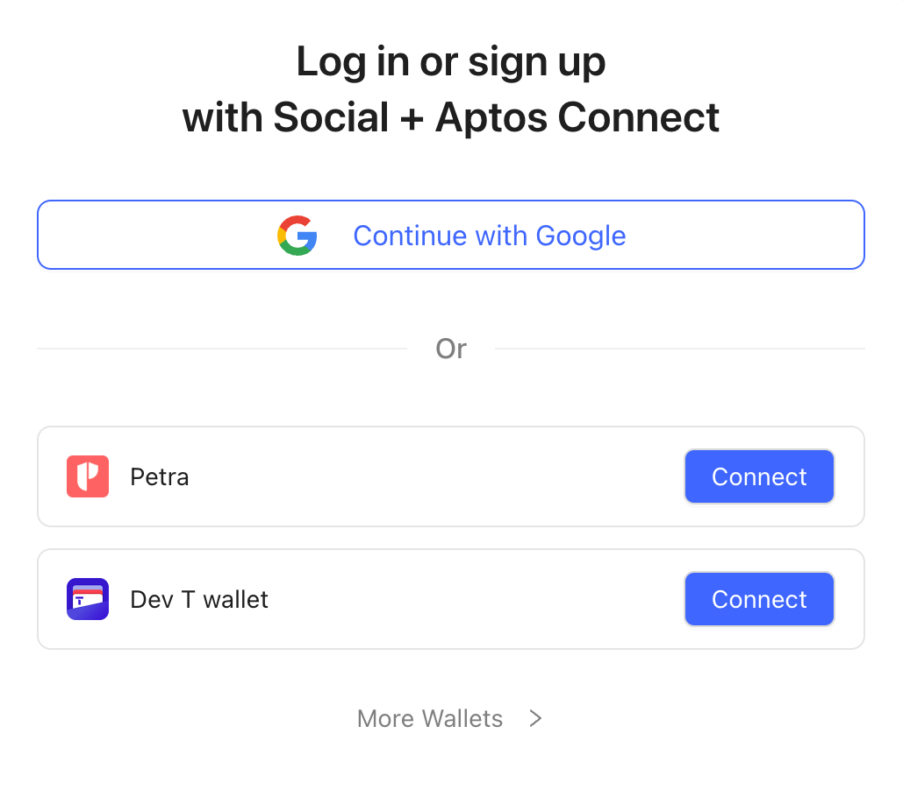

# Aptos Wallet Adapter Selector Ant Design

Package for wallet selector modal using [Ant Design](https://ant.design/). Includes a `wallet connect` button when clicked, opens up a `wallet select modal`.

If wallet is already connected, the button would display the connected account address truncated (i.e `0x123...abc`), in that case, clicking the button would disconnect the wallet.

### Usage

Make sure you have [@aptos-labs/wallet-adapter-react](../wallet-adapter-react/README.md) installed

```
npm install @aptos-labs/wallet-adapter-ant-design
```

on `index.tsx` / `_app.tsx` import the `ant-design` package `.css` file as

```
// If you use a local css file in your app, import it before the package's file as order matters
import "./my-style-file.css";

import "@aptos-labs/wallet-adapter-ant-design/dist/index.css";
```

On the page you want to include the `wallet connect` button, import the `WalletSelector` module.

```
import { WalletSelector } from "@aptos-labs/wallet-adapter-ant-design";
...
return (
  <WalletSelector />
)
```

That would add a `Connect Wallet` button when clicked opens up a `wallet selector` modal.

#### Override styles

You can override these classes

```
.wallet-selector-text
.wallet-menu-wrapper
.wallet-name-wrapper
.wallet-connect-button
.wallet-connect-install
.wallet-button
.wallet-modal-title
```

For example, to override the `connect wallet` button background color, you can use the `.wallet-button` class in your local `.css` file

```
.wallet-button{
  background-color:red;
}
```


