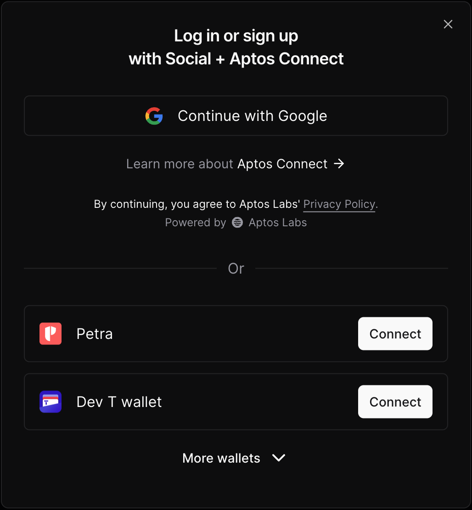
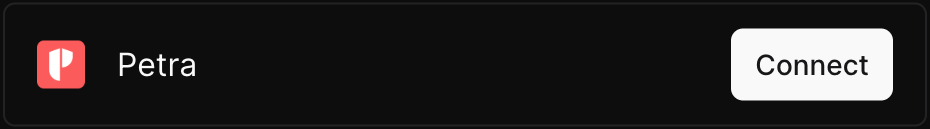
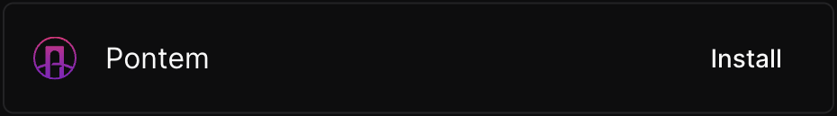
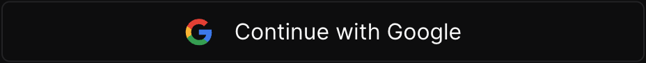
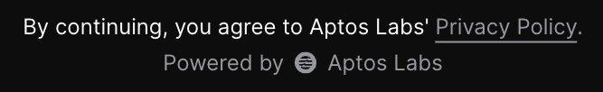
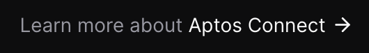
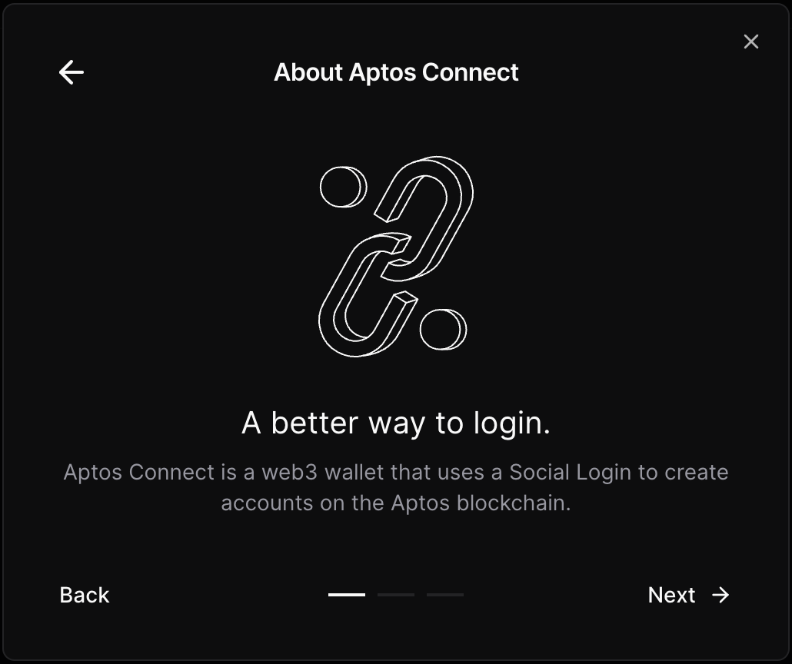
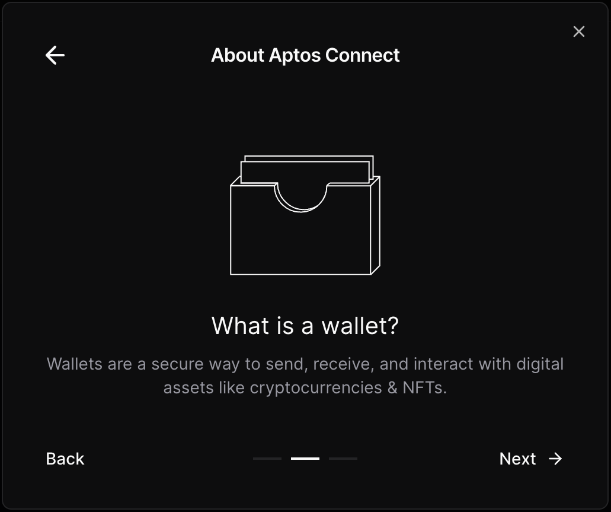
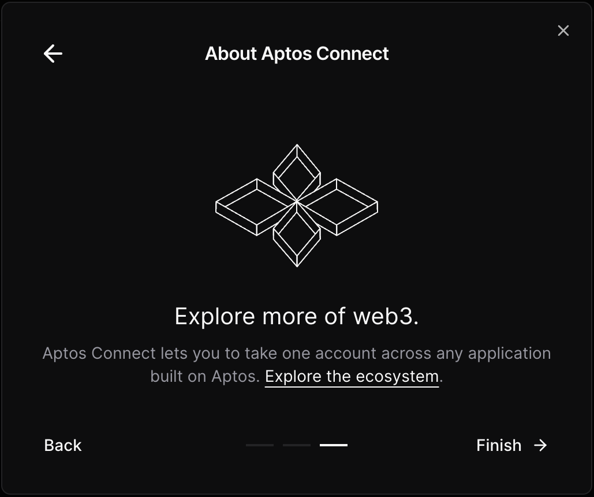

# Build Your Own Wallet Selector

Although we provide pre-made wallet selector components through `@aptos-labs/wallet-adapter-ant-design` and `@aptos-labs/wallet-adapter-mui-design`, you may want to create your own wallet selector component if you're not already using [Ant Design](https://ant.design/) or [Material UI](https://mui.com/material-ui/) in your project.

The `@aptos-labs/wallet-adapter-react` package exposes all of the primitives that have been created to maximize code reuse between our own wallet selector implementations. You can use these primitives yourself to implement your own wallet selector that integrates seamlessly with the look and feel of your application.

This document covers each primitive one-by-one, but if you want to see a full example of how these primitives can be composed to create a full wallet selector, refer to the implementation of the `shadcn/ui` wallet selector located in [`WalletSelector.tsx`](../../../apps/nextjs-example/src/components/WalletSelector.tsx) from the example Next.js app.



## Headless Components

The following components are "headless", meaning that they do not include any styles. They simply provide elements with pre-attached event handlers and `aria-*` properties. It is up to you to compose and style them as you wish.

The majority of these headless components accept the following props:

```ts
interface HeadlessComponentProps {
  /** A class name for styling the element. */
  className?: string;
  /**
   * Whether to render as the child element instead of the default element provided.
   * All props will be merged into the child element.
   */
  asChild?: boolean;
  children?: ReactNode;
}
```

The `asChild` prop adds additional flexibility to these components by allowing you to merge the functionality of these headless components onto your own components.

As an example, you can style the `WalletItem.ConnectButton` component in one of the following ways:

```tsx
const ConnectButton = () => (
  <WalletItem.ConnectButton className="myButtonClass" />
);
```

In this approach, a class name is passed to the component to add styles to the provided button element.

```tsx
import { Button } from "@/components/button";

const ConnectButton = () => (
  <WalletItem.ConnectButton asChild>
    <Button>Connect</Button>
  </WalletItem.ConnectButton>
);
```

In this approach, we use the `asChild` prop to merge all of the behaviors of the provided button element onto a pre-existing `Button` component that is shared across our application.

Below are the three groups of headless components available for building your wallet selector.

### `WalletItem`

```tsx
import {
  WalletItem,
  WalletItemProps,
  isInstallRequired,
} from "@aptos-labs/wallet-adapter-react";

const WalletRow = ({ wallet, onConnect }: WalletItemProps) => (
  <WalletItem wallet={wallet} onConnect={onConnect}>
    <WalletItem.Icon />
    <WalletItem.Name />
    {isInstallRequired() ? (
      <WalletItem.InstallLink />
    ) : (
      <WalletItem.ConnectButton />
    )}
  </WalletItem>
);
```




```tsx
import { WalletItem, WalletItemProps } from "@aptos-labs/wallet-adapter-react";

const PetraWebWalletRow = ({ wallet, onConnect }: WalletItemProps) => {
  return (
    <WalletItem wallet={wallet} onConnect={onConnect}>
      <WalletItem.ConnectButton>
        <WalletItem.Icon />
        <WalletItem.Name />
      </WalletItem.ConnectButton>
    </WalletItem>
  );
};
```



#### `WalletItem`

This is a headless component that serves as a wrapper element and sets up a React context to provide the wallet information to the rest of the `WalletItem.*` components.

#### `WalletItem.Icon`

This is a headless component that renders the icon of the wallet.

#### `WalletItem.Name`

This is a headless component that renders the name of the wallet.

#### `WalletItem.ConnectButton`

This is a headless component that renders a button that when clicked will connect the provided wallet.

#### `WalletItem.InstallLink`

This is a headless component that renders an anchor element that links to the install URL of the provided wallet.

### `AptosPrivacyPolicy`

```tsx
import { AptosPrivacyPolicy } from "@aptos-labs/wallet-adapter-react";

const PrivacyPolicy = () => (
  <AptosPrivacyPolicy>
    <p>
      <AptosPrivacyPolicy.Disclaimer /> <AptosPrivacyPolicy.Link />
    </p>
    <AptosPrivacyPolicy.PoweredBy />
  </AptosPrivacyPolicy>
);
```



#### `AptosPrivacyPolicy`

This is a headless component that simply serves as a wrapper element for the rest of the `AptosPrivacyPolicy.*` components.

#### `AptosPrivacyPolicy.Disclaimer`

This is a headless component that renders some disclaimer text that should precede the `AptosPrivacyPolicy.Link` component.

#### `AptosPrivacyPolicy.Link`

This is a headless component that renders an anchor element that links to the Aptos Labs privacy policy URL.

#### `AptosPrivacyPolicy.PoweredBy`

This is a headless component that renders the "Powered by Aptos Labs" text with an SVG graphic between "Powered by" and "Aptos Labs". While the wrapper element does accept a `className` prop, it does NOT accept an `asChild` or `children` prop like the other headless components.

### `AboutPetraWeb`

```tsx
import {
  AboutPetraWeb,
  AboutPetraWebEducationScreen,
} from "@aptos-labs/wallet-adapter-react";

const WalletSelector = () => (
  <AboutPetraWeb renderEducationScreen={renderEducationScreen}>
    <p>
      Learn more about <AboutPetraWeb.Trigger>Petra Web</AboutPetraWeb.Trigger>
    </p>
  </AboutPetraWeb>
);

const renderEducationScreen = (screen: AboutPetraWebEducationScreen) => {
  return (
    <>
      <div>
        <button onClick={screen.cancel}>Cancel</button>
        <h2>About Petra Web</h2>
      </div>
      <screen.Graphic />
      <screen.Title />
      <screen.Description />
      <div>
        <button onClick={screen.back}>Back</button>
        <div>
          {screen.screenIndicators.map((ScreenIndicator, i) => (
            <ScreenIndicator key={i} />
          ))}
        </div>
        <button onClick={screen.next}>
          {screen.screenIndex === screen.totalScreens - 1 ? "Finish" : "Next"}
        </button>
      </div>
    </>
  );
};
```






#### `AboutPetraWeb`

This component sets up a React context for managing the education screen flow, but does not render a wrapper element. Each of the education screens follow the same structure so the `renderEducationScreen` prop is a function that provides a `screen` object that you can map to a `ReactNode`. Each education screen will be rendered via your provided mapping function.

#### `AboutPetraWeb.Trigger`

This is a headless component that renders a button element that when clicked will trigger the education screen flow. When triggered, the children of the `AboutPetraWeb` component will be replaced with the current education screen so `AboutPetraWeb` should wrap the entire body of your wallet selector UI.

#### `AboutPetraWebEducationScreen`

This is the type of the `screen` object that is provided by `AboutPetraWeb`'s `renderEducationScreen` prop. You can map this object to a `ReactNode` to render each education screen. Each `screen` object has the following properties:

- `Graphic` - A component that renders an SVG to illustrate the idea of the current screen.
- `Title` - A headless component that renders the title of the current screen.
- `Description` - A headless component that renders the description text of the current screen.
- `screenIndex` - The index of the current education screen.
- `totalScreens` - The total number of education screens.
- `screenIndicators` - An array of headless components for indicating the current screen of the set. Each indicator will navigate the user to the screen it represents when clicked.
- `back` - A function that navigates the user to the previous education screen. If the user is on the first education screen, they will be navigated to the initial wallet selection screen.
- `next` - A function that navigates the user to the next education screen. If the user is on the last education screen, they will be navigated to the initial wallet selection screen.
- `cancel` - A function that navigates the user to the initial wallet selection screen.

## Utilities

### `isInstalledOrLoadable`

A function that returns `true` is the wallet is installed or loadable.

```ts
const installedOrLoadable = isInstalledOrLoadable(wallet);
```

### `partitionWallets`

A function that will partition the provided wallets into two list — `defaultWallets` and `moreWallets`. By default, the wallets will be partitioned by whether or not they are installed or loadable. You can pass your own partition function if you wish to customize this behavior.

```ts
const { defaultWallets, moreWallets } = partitionWallets(wallets);
```

### `isInstallRequired`

A function that returns `true` if the user is on desktop and the provided wallet requires installation of a browser extension. This can be used to decide whether to render `WalletItem.InstallLink` or `WalletItem.ConnectButton` in your wallet selector.

```tsx
isInstallRequired() ? <WalletItem.InstallLink /> : <WalletItem.ConnectButton />;
```

### `truncateAddress`

A function that truncates the provided wallet address at the middle with an ellipsis.

```ts
const truncatedAddress = truncateAddress(account?.address);
```

### `isPetraWebWallet`

A function that returns `true` if the provided wallet is an Petra Web wallet.

```ts
const isWalletPetraWeb = isPetraWebWallet(wallet);
```

### `getPetraWebWallets`

A function that partitions the `wallets` array so that Petra Web wallets are grouped separately from the rest. This is a specific implementation of the `partitionWallets` function mentioned above.

```ts
const { petraWebWallets, otherWallets } = getPetraWebWallets(wallets);
```

### `groupAndSortWallets`

A function that partitions the `wallets` array into three distinct groups:

- `petraWebWallets` - Wallets that use social login to create accounts on
  the blockchain via Petra Web.
- `availableWallets` - Wallets that are currently installed or loadable by the client.
- `availableWalletsWithFallbacks` - Wallets that are currently uninstalled that have a fallback wallet.
- `installableWallets` - Wallets that are NOT current installed or loadable and
  require the client to install a browser extension first.

Additionally, these wallet groups can be sorted by passing the following sort functions via the `options` argument:

- `sortPetraWebWallets`
- `sortAvailableWallets`
- `sortInstallableWallets`
- `fallbacks`

```ts
const {
  petraWebWallets,
  availableWallets,
  availableWalletsWithFallbacks,
  installableWallets,
} = groupAndSortWallets(wallets, walletSortingOptions);
```
